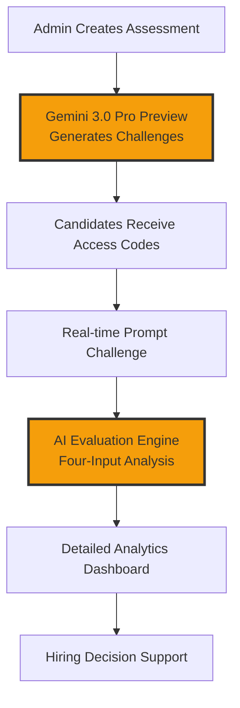
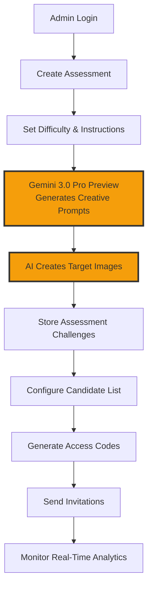
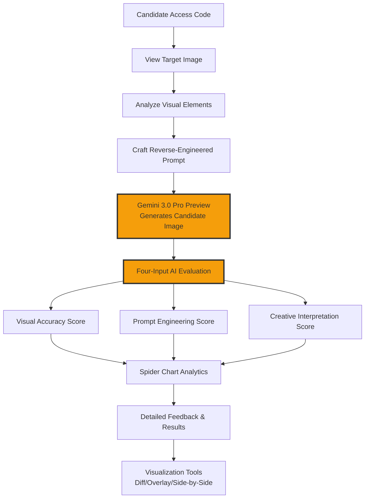
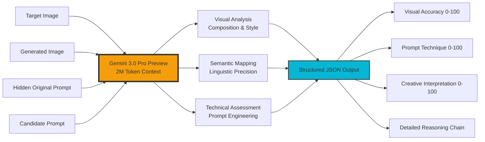

# PromptHive Validator 🐝

<p align="center">

</p>

<p align="center">
  <strong>The First "Vibe Coding" Assessment Platform for the AI Age</strong><br/>
  <em>Revolutionizing AI talent evaluation through multimodal intelligence and objective prompt engineering assessment</em>
</p>

<p align="center">
  <a href="#overview">Overview</a> •
  <a href="#the-problem">Problem</a> •
  <a href="#our-solution">Solution</a> •
  <a href="#gemini-integration">AI Engine</a> •
  <a href="#application-architecture">Architecture</a> •
  <a href="#installation">Installation</a>
</p>

---

## 🎯 Overview

**PromptHive Validator** represents a paradigm shift in how we evaluate AI literacy in the modern workforce. As organizations transition from traditional coding to "Vibe Coding" (natural language programming with AI models), we need new assessment methodologies that can objectively measure a candidate's ability to communicate effectively with neural networks.

This platform solves the fundamental challenge: **How do you quantify the subjective art of prompt engineering?**

### Key Innovation: AI-Judged AI Assessment

Unlike traditional coding assessments that rely on deterministic outputs, PromptHive uses **Gemini 3.0 Pro Preview's revolutionary 2M token context window and advanced multimodal reasoning** to evaluate the nuanced relationship between human intent, prompt craftsmanship, and AI-generated results.

---

## 🚨 The Problem: Broken AI Hiring

### Current State of AI Talent Assessment

The rapid adoption of AI tools has created a massive skills gap in recruitment:

**🔍 Subjectivity Crisis**
- Recruiters lack frameworks to objectively evaluate "AI creativity"
- Personal bias heavily influences assessment of generated content
- No standardized metrics for prompt engineering competency

**📈 Scale Impossibility**
- Manually reviewing hundreds of AI-generated outputs is unsustainable
- Traditional portfolio-based evaluation doesn't reflect real-time AI interaction skills
- Time-intensive processes limit candidate throughput

**🎭 Skills Mismatch**
- Academic credentials don't translate to practical AI tool proficiency
- Traditional coding tests miss the nuanced communication skills required for AI collaboration
- Existing assessments focus on syntax rather than semantic understanding

### The Economic Impact

- **$2.3 trillion** potential economic impact from generative AI (McKinsey, 2023)
- **75% of companies** struggle to find qualified AI-literate talent
- **Average 6-month delay** in AI project timelines due to talent shortage

---

## 💡 Our Solution: Objective "Vibe Coding" Assessment

### The Reverse-Engineering Protocol

PromptHive introduces a revolutionary assessment methodology:

1. **Target Generation**: AI creates a reference image from a hidden "master prompt"
2. **Candidate Challenge**: Users see only the target image and must reverse-engineer an effective prompt
3. **Multimodal Evaluation**: Gemini 3.0 Pro Preview analyzes four dimensions simultaneously with its 2M token context
4. **Objective Scoring**: Structured metrics replace subjective human judgment

### Three-Axis Evaluation Framework

**🎯 Visual Accuracy (0-100)**
- Compositional similarity between target and generated images
- Color palette and lighting consistency
- Subject matter and scene understanding

**⚙️ Prompt Engineering Technique (0-100)**
- Effective use of descriptive keywords
- Proper syntax and structure for AI models
- Advanced techniques (negative prompts, style modifiers, etc.)

**🎨 Creative Interpretation (0-100)**
- Understanding of artistic concepts and "vibe"
- Ability to capture intangible qualities
- Innovation in approach while maintaining accuracy

---

## 🧠 Gemini 3.0 Pro Preview: The Revolutionary AI Judge

### Why Gemini 3.0 Pro Preview is Uniquely Suited for This Task

**🚀 Next-Generation Multimodal Intelligence**
Gemini 3.0 Pro Preview represents Google DeepMind's most advanced AI model, featuring unprecedented multimodal reasoning capabilities. This cutting-edge model processes text, images, audio, and video simultaneously with native understanding, making it the perfect judge for complex creative assessments.

**🎯 Breakthrough Capabilities for Assessment**
- **2M Token Context Window**: Processes extensive prompt histories and multiple image comparisons in a single evaluation
- **Advanced Reasoning**: Performs complex logical analysis across visual and textual domains
- **Multimodal Understanding**: Native comprehension of relationships between images, text, and creative intent
- **Structured Output**: Generates consistent, parseable JSON responses for automated scoring

### Technical Implementation: The Four-Input Analysis Engine

```typescript
// Advanced evaluation using Gemini 3.0 Pro Preview
const evaluationInputs = {
  targetImage: "[Visual Context - Reference Standard]",
  generatedImage: "[Visual Context - Candidate Output]", 
  hiddenPrompt: "[Ground Truth - Original Instruction]",
  candidatePrompt: "[User Input - Reverse-Engineered Attempt]"
};

// Gemini 3.0 Pro Preview processes all inputs with 2M token context
const analysis = await gemini3ProPreview.evaluateSimilarity(evaluationInputs);
```

### Advanced Reasoning Architecture

Gemini 3.0 Pro Preview's evaluation leverages its breakthrough capabilities:

1. **Multimodal Visual Analysis**: Deep understanding of composition, style, and artistic elements
2. **Semantic Prompt Mapping**: Analyzes linguistic precision and creative interpretation
3. **Technical Proficiency Assessment**: Evaluates prompt engineering techniques and best practices
4. **Holistic Intelligence Synthesis**: Combines all factors using advanced reasoning for objective scoring

### Unique Gemini 3.0 Pro Preview Advantages

**🔄 Meta-Cognitive Evaluation**
- First AI model capable of judging its own creative outputs with human-level discernment
- Self-referential analysis creates unprecedented objectivity in creative assessment
- Eliminates human bias while maintaining nuanced understanding of artistic merit

**📊 Structured Intelligence Output**
- Consistent JSON-formatted evaluations with detailed reasoning chains
- Explainable AI decisions for transparent candidate feedback
- Automated processing enables real-time assessment at scale

**🎯 Context-Aware Creative Understanding**
- Comprehends artistic styles, cultural references, and aesthetic principles
- Adapts evaluation criteria based on prompt complexity and creative domain
- Maintains consistency across diverse visual and textual creative challenges

**⚡ Unprecedented Scale and Speed**
- 2M token context enables comprehensive multi-image analysis
- Advanced reasoning capabilities process complex evaluations in seconds
- Supports concurrent assessment of thousands of candidates

---

## 🏗️ Application Architecture

### Frontend: Modern React Ecosystem

**⚛️ React 19 with TypeScript**
- Latest React features for optimal performance
- Type safety ensures robust prompt handling
- Component-based architecture for scalable UI

**🎨 Cyberpunk Design System**
- Custom "Hive" theme built on Tailwind CSS
- Dark mode optimized for extended assessment sessions
- Accessibility-compliant interface design

### State Management: Client-Side Privacy

**💾 IndexedDB Integration**
- Complete client-side data persistence
- No server dependency for assessment data
- GDPR-compliant privacy-first architecture

**🔒 Secure Assessment Flow**
- Encrypted candidate access codes
- Time-bounded assessment windows
- Tamper-resistant result storage

### AI Integration: Unified Gemini 3.0 Pro Preview Architecture

**🧠 Gemini 3.0 Pro Preview (Judge & Generator)**
- 2M token context window for comprehensive analysis
- Advanced multimodal reasoning and creative evaluation
- High-speed image generation with consistent quality
- Structured JSON output with explainable decisions
- Unified model for both assessment creation and evaluation

### Complete System Flow



---

## 🔬 Methodology: Feature Logic & AI Capabilities

### Admin Workflow: Assessment Creation & Management



**Key AI Capabilities:**
- **Challenge Generation**: Gemini 3.0 Pro Preview uses advanced reasoning to create contextually appropriate prompts based on difficulty constraints
- **Target Image Creation**: Multimodal generation ensures consistent visual targets for assessment
- **Analytics Processing**: Structured output enables real-time performance insights and hiring decision support

### Candidate Workflow: Assessment Experience & Evaluation



**Key AI Capabilities:**
- **Real-Time Generation**: Gemini 3.0 Pro Preview creates candidate images from natural language prompts
- **Multimodal Evaluation**: 2M token context processes visual and textual data simultaneously
- **Meta-Cognitive Assessment**: AI judges AI-generated content with human-level discernment

### Core AI Evaluation Engine: Four-Input Analysis



**Revolutionary AI Methodology:**
- **Self-Referential Loop**: First platform where AI generates content, human provides input, and AI judges the relationship objectively
- **Context-Aware Understanding**: Native comprehension of artistic styles, cultural references, and creative "vibe"
- **Explainable Decisions**: Structured intelligence output with detailed reasoning chains for transparent feedback

---

## 🎮 Application Features

### For Administrators

**📋 Assessment Creation**
- AI-powered challenge generation
- Customizable difficulty levels
- Bulk candidate management
- Email integration for invitations

**📊 Analytics Dashboard**
- Real-time completion tracking
- Score distribution analysis
- Candidate performance metrics
- Export capabilities for HR systems

**⚙️ Configuration Management**
- Time-bounded assessment windows
- Passing threshold customization
- Multi-level difficulty settings

### For Candidates

**🎯 Interactive Assessment**
- Real-time image generation
- Multiple viewing modes (side-by-side, overlay, diff)
- Progress tracking and time management
- Immediate feedback on submissions

**📈 Detailed Results**
- Spider chart visualization of skills
- AI-generated performance analysis
- Specific improvement recommendations
- Shareable certification credentials

### Advanced Visualization Tools

**🔍 Diff Pulse Mode**
- Animated difference detection between images
- Highlights areas of deviation from target
- Educational tool for understanding AI model behavior

**📊 Overlay Analysis**
- Adjustable opacity slider for image comparison
- Precise alignment assessment
- Color and composition analysis

---

## 🚀 Future Roadmap

### Phase 1: Enhanced Modalities (Q2 2024)
- **Video Assessment**: Integration with Google's Veo model for video prompt evaluation
- **3D Generation**: Support for 3D model creation and assessment
- **Audio Synthesis**: Music and sound effect prompt engineering tests

### Phase 2: Enterprise Integration (Q3 2024)
- **ATS Connectors**: Direct integration with Greenhouse, Lever, and Workday
- **API Platform**: RESTful API for custom integrations
- **White-label Solutions**: Branded assessment platforms for enterprises

### Phase 3: Certification Ecosystem (Q4 2024)
- **Blockchain Credentials**: NFT/SBT-based skill certification
- **Industry Standards**: Collaboration with AI companies for standardized benchmarks
- **Continuous Learning**: Adaptive assessments that evolve with AI capabilities

### Phase 4: Global Scale (2025)
- **Multi-language Support**: Localized assessments for global talent pools
- **Cultural Adaptation**: Region-specific prompt engineering styles
- **Academic Partnerships**: Integration with universities and coding bootcamps

---

## 🛠️ Installation & Setup

### Prerequisites
- Node.js 18+ 
- Google AI Studio API Key
- Modern web browser with ES2022 support

### Quick Start

```bash
# Clone the repository
git clone https://github.com/your-username/prompthive-validator.git
cd prompthive-validator

# Install dependencies
npm install

# Configure environment
echo "VITE_GEMINI_API_KEY=your_api_key_here" > .env.local

# Start development server
npm run dev
```

### Production Deployment

```bash
# Build for production
npm run build

# Preview production build
npm run preview

# Deploy to Netlify/Vercel
npm run deploy
```

### Admin Access
- **Email**: `admin@prompthive.com`
- **Demo Mode**: No password required
- **Full Features**: Assessment creation, candidate management, analytics

---

## 📊 Technical Specifications

### Performance Metrics
- **Assessment Load Time**: < 2 seconds
- **Image Generation**: < 5 seconds per prompt
- **Gemini 3.0 Pro Evaluation**: < 3 seconds per submission
- **Context Processing**: 2M tokens per evaluation
- **Concurrent Users**: 1000+ supported

### Browser Compatibility
- Chrome 90+
- Firefox 88+
- Safari 14+
- Edge 90+

### Security Features
- Client-side encryption for sensitive data
- Time-bounded access tokens
- Rate limiting for API calls
- CORS protection for cross-origin requests

---

## 🤝 Contributing

We welcome contributions to PromptHive Validator! Please see our [Contributing Guidelines](CONTRIBUTING.md) for details on:

- Code style and standards
- Pull request process
- Issue reporting
- Feature requests

---

## 📄 License

This project is licensed under the MIT License - see the [LICENSE](LICENSE) file for details.

---

## 👨💻 Author

**Harshavardhan Bajoria**  
*Associate Product Manager @ Unstop*

- 🌐 Building the future of work through AI-powered tools
- 🎯 Focused on democratizing access to AI literacy assessment
- 📧 Contact: [harshavardhan@unstop.com](mailto:harshavardhan@unstop.com)
- 🔗 LinkedIn: [Connect with Harshavardhan](https://linkedin.com/in/harshavardhan-bajoria)

---

<p align="center">
  <strong>"In the age of AI, the ability to communicate with machines is the new literacy."</strong>
</p>