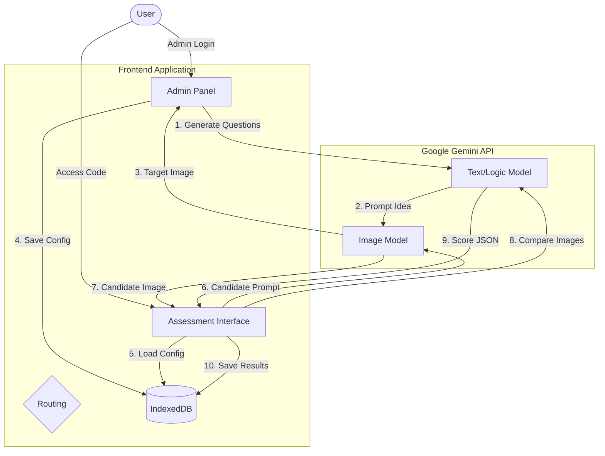
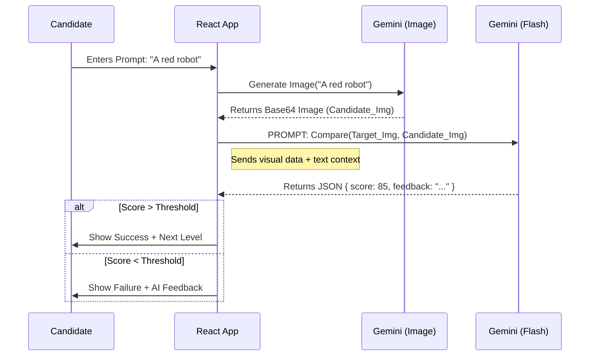

# PromptHive Validator 🐝

**PromptHive Validator** is a professional AI Assessment Platform designed to validate "Prompt Engineering" skills. It turns the subjective art of prompting into an objective, scored assessment by asking candidates to reverse-engineer generated images.

---

## 🧠 Core Logic & The "Vibe Check"

The core innovation of this application is the **AI-driven Judge**. Unlike traditional coding tests where output is binary (pass/fail based on unit tests), Generative AI output is subjective.

### How Scoring Works
The system uses a **multi-model approach**:

1.  **Asset Generation (Admin Side):**
    *   The Admin defines a difficulty (e.g., "Hard - Abstract Styles").
    *   `gemini-2.5-flash` creates a secret, complex prompt.
    *   `gemini-3-pro-image-preview` generates the **Target Image** based on that secret prompt.

2.  **Candidate Simulation:**
    *   The Candidate sees *only* the Target Image.
    *   They write a prompt to attempt to recreate it.
    *   `gemini-3-pro-image-preview` generates the **Candidate Image**.

3.  **The Judge (Evaluation):**
    *   We send **both** images (Target & Candidate) and **both** prompts (Hidden & User) back to `gemini-2.5-flash`.
    *   The model acts as an "Auditor" with a specific system instruction to score based on three axes:
        *   **Visual Accuracy:** Do the images look alike? (Composition, lighting, color).
        *   **Prompt Technique:** Did the user employ structural keywords (e.g., "volumetric lighting", "8k", "isometric")?
        *   **Creativity:** Did they capture the "vibe" even if pixels aren't identical?
    *   The result is a structured JSON object containing scores (0-100) and constructive feedback.

---

## 🌊 Application Flow

### 1. The Admin Workflow (Creation)
1.  **Configuration:** Admin sets logistics (Name, Dates, Duration).
2.  **Challenge Generation:** Admin selects a difficulty level. The system uses AI to generate unique "Target Images" on the fly.
3.  **Candidate Management:** Admin imports emails (CSV/Manual). Access codes are hashed/generated.
4.  **Preview:** Admin can test the exam in a sandboxed overlay.
5.  **Deployment:** Configuration is saved to **IndexedDB** (Local Browser Storage).

### 2. The Candidate Workflow (Execution)
1.  **Access:** Candidate logs in with an email and access code.
2.  **Briefing:** Instructions are shown.
3.  **The Loop:**
    *   **Analyze:** View Target Image.
    *   **Prompt:** Write a prompt in the terminal editor.
    *   **Run:** Generate an image.
    *   **Fail:** If similarity < Threshold (e.g., 70%), the AI provides textual hints. View "Diff" or "Overlay" modes to see gaps.
    *   **Pass:** Proceed to the next level.
4.  **Results:** A detailed report card with Spider Charts and an overall grade.

---

## 🛠 Technical Architecture

### Tech Stack
*   **Frontend:** React 19, TypeScript, Vite.
*   **Styling:** Tailwind CSS (Dark/Slate theme).
*   **AI Engine:** Google GenAI SDK (`@google/genai`).
*   **Persistence:** IndexedDB (via native wrappers). No external SQL database is required; data lives in the admin's browser.
*   **Icons:** Lucide React.

### Key Components
*   `AdminPanel`: Monolith component for managing state, drag-and-drop config, and AI generation triggers.
*   `VibeAssessment`: The game engine. Handles the timer, image generation calls, and state machine for questions.
*   `geminiService.ts`: The abstraction layer for API calls. Handles error parsing, base64 image conversion, and JSON schema enforcement for the Judge.

---

## 📊 System Diagrams

### High-Level Data Flow



### The "Judge" Logic Flow

This diagram explains specifically what happens when a candidate clicks "Run Protocol".



---

## 🚀 Setup & Installation

1.  **Environment Variables:**
    Create a `.env` file or set the environment variable in your runtime.
    ```bash
    API_KEY=your_google_gemini_api_key
    ```

2.  **Install Dependencies:**
    (Note: This project uses CDN imports in the provided code, but for a local setup:)
    ```bash
    npm install react react-dom @google/genai lucide-react
    ```

3.  **Run:**
    ```bash
    npm run dev
    ```

---

## ⚠️ Data Persistence Note
This application uses **IndexedDB** for storage. This means:
1.  Data is stored **locally** on the device/browser where the Admin configures the test.
2.  If you clear your browser cache, you lose the assessments.
3.  In a real-world deployment, `services/storage.ts` should be swapped to point to a cloud database (Firebase, Supabase, Postgres).
